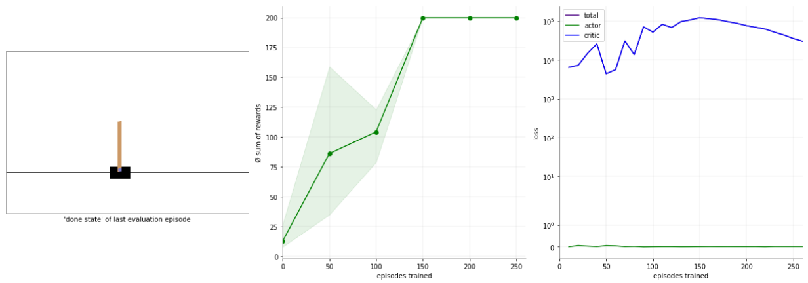
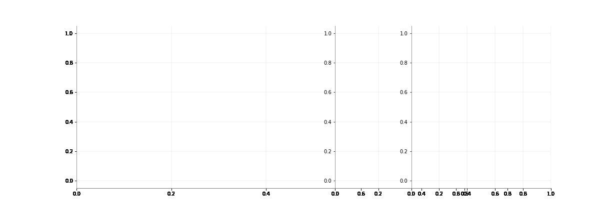

### Reinforcement Learning for Practitioners (v1.2, 19Q4)

[](https://coveralls.io/github/christianhidber/easyagents?branch=master)

[](https://pepy.tech/project/easyagents/month)
[](https://christianhidber.github.io/easyagents/)


Status: under active development, breaking changes may occur. [Release notes](documentation/markdown/Release Notes.md).


EasyAgents is a high level reinforcement learning api focusing on ease of use and simplicity.
Written in Python and running on top of established reinforcement learning libraries like
[tf-Agents](https://github.com/tensorflow/agents), 
[tensorforce](https://github.com/tensorforce/tensorforce) or 
[keras-rl](https://github.com/keras-rl/keras-rl).
Environments are implemented in [OpenAI gym](https://github.com/openai/gym). 

In collaboration with [Oliver Zeigermann](http://zeigermann.eu/). 

### Features 
---
* provides the **same, simple api across all libraries**. Thus you can easily switch between different implementations
  and you don't have to learn for each of them a new api.
* to create and run any algorithm you only need **2 lines of code**, all the parameters are named
  consistently across all algorithms.
* supports a broad set of different algorithms
* runs inside **jupyter notebooks** as well as stand-alone, easy to install requiring only a single 
  'pip install easyagents'.
* easy to understand, **ready-made plots** and logs to investigate the algorithms and environments behaviour

### Examples
---
````
from easyagents.agents import PpoAgent
from easyagents.callbacks import plot

ppoAgent = PpoAgent('CartPole-v0')
ppoAgent.train([plot.State(), plot.Loss(), plot.Rewards()])
````


#### More Detailed
````
from easyagents.agents import PpoAgent
from easyagents.callbacks import plot

ppoAgent = PpoAgent( 'Orso-v1',fc_layers=(500,500,500))
ppoAgent.train([plot.State(), plot.Loss(), plot.Rewards(), plot.Actions(), 
                plot.StepRewards(), plot.Steps(), plot.ToMovie()], 
                learning_rate = 0.0001, num_iterations = 500, max_steps_per_episode=50 )
````



### Try it on colab
---
* [1. Introduction (CartPole on colab)](https://colab.research.google.com/github/christianhidber/easyagents/blob/master/jupyter_notebooks/easyagents_cartpole.ipynb):
   training, plotting, switching algorithms & backends. based on the classic reinforcement learning example 
   balancing a stick on a cart.
* [2. Next steps & backend switching (Orso on colab)](https://colab.research.google.com/github/christianhidber/easyagents/blob/master/jupyter_notebooks/easyagents_orso.ipynb):
  custom training, creating a movie & switching backends. gym environment based on a routing problem.
* [3. Creating your own environment (LineWorld on colab)](https://colab.research.google.com/github/christianhidber/easyagents/blob/master/jupyter_notebooks/easyagents_line.ipynb):
  implement a gym environment from scratch, workshop example.
* [4. Logging, seeding & plot clearing (on colab)](https://colab.research.google.com/github/christianhidber/easyagents/blob/master/jupyter_notebooks/easyagents_logging.ipynb): 
  Investigate how an agents api and how it interacts with the gym environment; 
  how to set seeds; controlling jupyter output cell clearing

### Available Algorithms and Backends
---

|algorithm | [tf-Agents](https://github.com/tensorflow/agents) | [tensorforce](https://github.com/tensorforce/tensorforce) | [keras-rl](https://github.com/keras-rl/keras-rl) | easyagents class name |
|----------|:---------:|:-----------:|:--------:| :---: | 
|[CEM](https://citeseerx.ist.psu.edu/viewdoc/download?doi=10.1.1.81.6579&rep=rep1&type=pdf) |`not available`  |`not available`  |`yes`  | CemAgent | 
|[Dqn](https://arxiv.org/abs/1312.5602)           |`yes`           |`yes`    |`yes`            | DqnAgent | 
|[Double Dqn](https://arxiv.org/abs/1509.06461)   |`open`          |`not available`    |`yes`  | DoubleDqnAgent|
|[Dueling Dqn](https://arxiv.org/abs/1511.06581)  | `not available`        |`not yet available`    |`yes`   | DuelingDqnAgent|
|[Ppo](https://arxiv.org/abs/1707.06347)          |`yes`           |`yes`     |`not available` | PpoAgent |
|Random                                           |`yes`           |`yes`    |`not available`  | RandomAgent |
|[REINFORCE](http://www-anw.cs.umass.edu/~barto/courses/cs687/williams92simple.pdf)  |`yes`  |`yes` |`not available`| ReinforceAgent | 
|[SAC](https://arxiv.org/abs/1801.01290)          |`preview`          |`not available`|`not available`|SacAgent|

[191001]

* if you are interested in other algorithms, backends or hyperparameters let us know by
 [creating an issue](https://github.com/christianhidber/easyagents/issues/new/choose). 
  We'll try our best to support you.
* keras-rl is not compatible with tensorflow eager execution mode.
Thus keras-rl based agents should run in a different python / jupyter notebook instance 
than  tf-agents or tensorforce based agents.


### Industrial Application

[Geberit](https://www.geberit.com/en/) - a sanitary technology company with > 12'000 employees -
produces in particular pipes and other parts to get rain-water of flat roofs - so called
[syphonic roof drainage systems](https://www.international.geberit.com/products/piping-systems-drainage/geberit-pluvia-roof-drainage/). 
They warrant that large buildings like stadiums, airports or shopping malls do not collapse during 
heavy rainfalls. 
However it is surprisingly difficult to find the right dimensions for the pipes. 
It is actually so difficult, that as of today **no feasable, deterministic algorithm** is known. 
Thus traditional heuristics and classic machine learning were used to support the users 
in finding a suitable solution.

Using reinforcement learning, the failrate of the previous solution was reduced by 70%, resulting
in an end-to-end success-rate of > 98%.

 

For more details take a look at this [talk](https://www.youtube.com/watch?v=FCyZplb0ul4).


### Installation
---
Install from pypi using pip:

```python
pip install easyagents
```


### More
---
#### Documentation
[release notes, class diagram](documentation/Markdown/Release Notes.md)

#### Guiding Principles
* easily train, evaluate & debug policies for (you own) gym environment over "designing new algorithms"
* simple & consistent over "flexible & powerful"
* inspired by keras: 
    * same api across all algorithms
    * support different implementations of the same algorithm 
    * extensible (pluggable backends, plots & training schemes)   

#### EasyAgents may not be ideal if

* you would like to leverage implementation specific advantages of an algorithm
* you want to do distributed or in parallel reinforcement learning

#### Note

* If you have any difficulties in installing or using easyagents please let us know by 
  [creating an issue](https://github.com/christianhidber/easyagents/issues/new/choose).
  We'll try our best to help you.
* Any ideas, help, suggestions, comments etc in python / open source development / reinforcement learning / whatever
  are more than welcome. 
