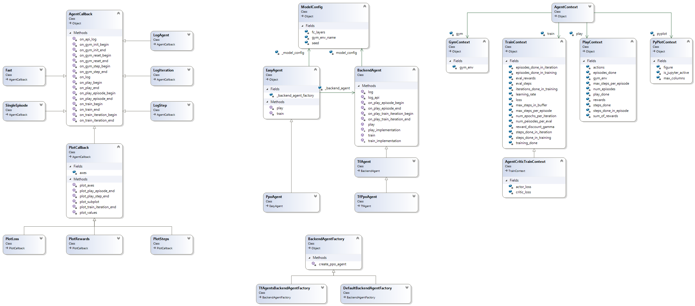

## Release notes
* v1.1 [19Q4]
    * 1.1.23: CemAgent for keras-rl backend; DqnAgent, RandomAgent for tensorforce
    * 1.1.22: DuelingDqnAgent, DoubleDqnAgent with keras-rl backend
    * 1.1.21: keras-rl backend (dqn)
    * 1.1.20: #54 logging in jupyter notebook solved, doc updates
    * 1.1.19: 
        * jupyter plotting performance improved
        * plot.ToMovie with support for animated gifs 
    * 1.1.18: tensorforce backend (ppo, reinforce)
    * 1.1.11:
        * plot.StepRewards, plot.Actions
        * default_plots parameter (instead of default_callbacks)
        
* v1.0.1 [19Q3]
    * api based on pluggable backends and callbacks (for plotting, logging, training durations)
    * backend: tf-agents, default
    * algorithms: dqn, ppo, random
    * plots: State, Loss (including actor-/critic loss), Steps, Rewards
    * support for creating a mp4 movie (plot.ToMovie) 
* v0.1 [19Q2]
    * prototype implementation / proof of concept
    * hard-wired support for Ppo, Reinforce, Dqn on tf-agents
    * hard-wired plots for loss, sum-of-rewards, steps and state rendering 
    * hard-wired mp4 rendering
    
## Design guidelines
* separate "public api" from concrete implementation using a frontend / backend architecture 
  (inspired by scikit learn, matplotlib, keras)
* pluggable backends
* extensible through callbacks (inspired by keras). separate callback types for training, evaluation and monitoring
* pre-configurable, algorithm specific train & play loops 
    
## Class diagram

 